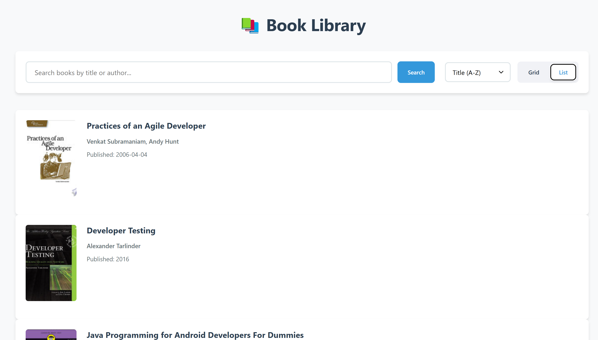
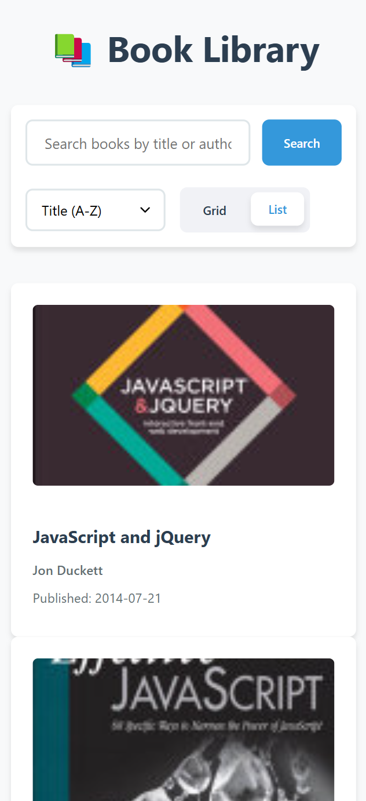
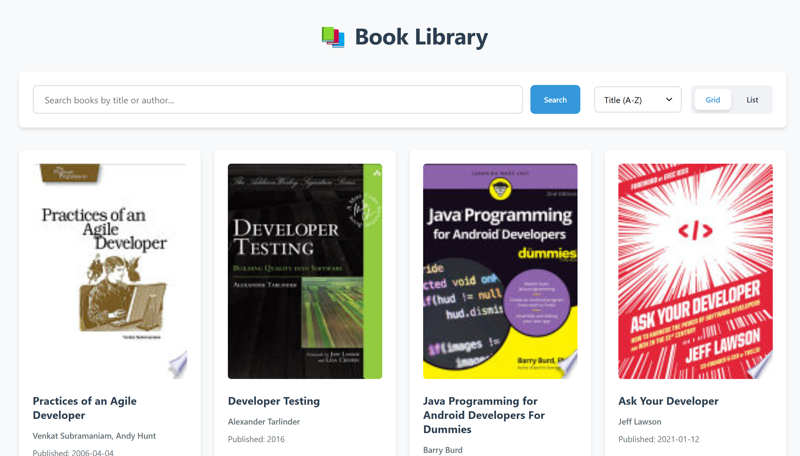
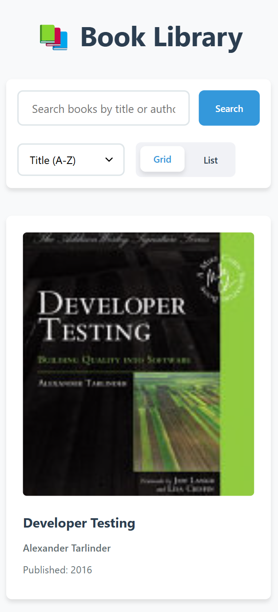

# Book Library App

This project is a **Book Library App** that fetches book data from an API and displays it with sorting, searching, and infinite scrolling features.

## 🚀 Features

- 🔍 **Search Books** by title
- 📚 **Fetch Books** from an API
- 📊 **Sort Books** by title or published date
- 🔄 **Infinite Scrolling** for seamless browsing
- 🌐 **Click on Books** to open their Google Books page
- 🖼️ **Grid & List View** toggle

## 📂 Project Structure

```
📦 Book-Library-App
 ┣ 📜 index.html        # Main HTML file
 ┣ 📜 script.js         # Main JavaScript logic
 ┣ 📜 style.css         # CSS styles
 ┣ 📜 README.md         # Project documentation
```
## Screenshots
<p align="center">
  
  <br>
  <strong>Figure 1: Desktop List Interface</strong>
</p>
<p align="center">
  
  <br>
  <strong>Figure 2: Mobile List Interface</strong>
</p>
<p align="center">
  
  <br>
  <strong>Figure 3: Desktop Grid Interface</strong>
</p>
<p align="center">
  
  <br>
  <strong>Figure 4: Mobile Grid Interface</strong>
</p>


## 🛠️ Installation

1. **Clone the Repository:**
   ```sh
   git clone https://github.com/suprabhat3/book-Library.git
   ```
2. **Open ************`index.html`************ in a browser**

## 🖥️ Usage

1. Enter a book title in the search box and press **Search**
2. Click on **Sort Dropdown** to change sorting order
3. Scroll down to load more books
4. Click on a **Book** to open it in Google Books

## 🔧 API Used

- **API Endpoint:** [FreeAPI Books](https://api.freeapi.app/api/v1/public/books)
- **Example API Response:**
  ```json
  {
    "statusCode": 200,
    "data": {
      "data": [
        {
          "id": 1,
          "volumeInfo": {
            "title": "Practices of an Agile Developer",
            "authors": ["Venkat Subramaniam", "Andy Hunt"],
            "publishedDate": "2006",
            "infoLink": "https://books.google.com/books?id=KA9QDwAAQBAJ"
          }
        }
      ]
    }
  }
  ```

## 💡 Contributing

Feel free to fork this project and submit pull requests. Contributions are welcome!

## 🛠️ Technologies Used

- **HTML**
- **CSS**
- **JavaScript**
- **Fetch API**

## 📜 License

This project is for Educational purposes only 

